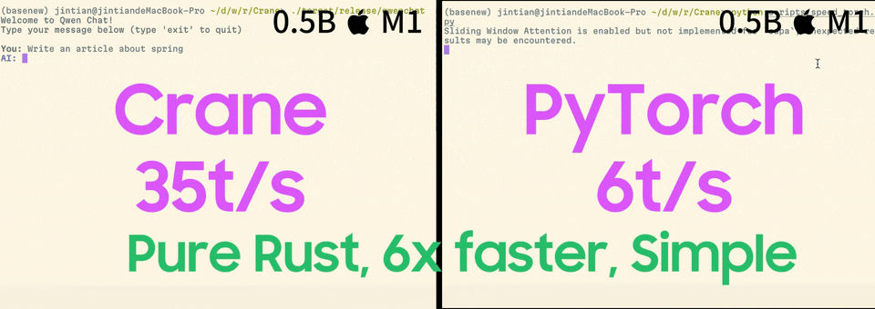

# Crane 🦩

> Crane focusing on accelerate LLM inference speed with the power of kernels in candle framework, while reducing development overhead, make it portable and fast run model on both CPU and GPU.




**Crane (🦩)** - **C**andle-based **R**ust **A**ccelerated **N**eural **E**ngine
A high-performance inference framework leveraging Rust's Candle for maximum speed on CPU/GPU.

**Supported Models**:

- 🎙️ TTS Systems:[Spark-TTS](https://github.com/SparkAudio/Spark-TTS) | [Orpheus-TTS](https://github.com/canopyai/Orpheus-TTS) (WIP)
- 🧠 Foundation Models:Qwen2.5 series (Base/VL), Basic LLMs
- 🌌 Multimodal Models:
  Namo-R1, Qwen2.5-VL

**Key Advantages**:

- 🚀 **Blazing-Fast Inference**: Outperforms native PyTorch with Candle's optimized kernels;
- 🦀 **Rust-Powered**: Eliminate C++ complexity while maintaining native performance;
- 🍎 **Apple Silicon Optimized**: Achieve GPU acceleration via Metal on macOS devices;
- 🤖 **Hardware Agnostic**: Unified codebase for CPU/CUDA/Metal execution;


## 🔥 Updates

- **`2025.03.21`**: 🔥 Qwen2.5 a more transformers liked Rust interface were supported, you now use Crane just like in your python;
- **`2025.03.19`**: 🔥 project initialized;


## 🧐 Why Choose Crane?

While traditional approaches face limitations:

- PyTorch's suboptimal inference performance
- llama.cpp's complex C++ codebase and model integration

Crane bridges the gap through:

1. **Candle Framework**: Combines Rust's efficiency with PyTorch-like ergonomics
2. **Cross-Platform Acceleration**: Metal GPU support achieves 3-5x speedup over CPU-only
3. **Simplified Deployment**: Add new models with <100 LOC in most cases

💡 **Pro Tip**: For macOS developers, Crane delivers comparable performance to llama.cpp with significantly lower maintenance overhead. You can use it out of box directly without any GGUF conversion or something like install llama.cpp etc.

Speed up your LLM inference speed on M series Apple Silicon devices to 6x with almost simillar code in your python (No quantization needed!):

```rust

use clap::Parser;
use crane_core::{
    Msg,
    autotokenizer::AutoTokenizer,
    chat::Role,
    generation::{GenerationConfig, based::ModelForCausalLM, streamer::TextStreamer},
    models::{DType, Device, qwen25::Model as Qwen25Model},
};

#[derive(Parser, Debug)]
#[clap(about, version, author)]
struct Args {
    #[clap(short('m'), long, default_value = "checkpoints/Qwen2.5-0.5B-Instruct")]
    model_path: String,
}

fn main() {
    crane_core::utils::utils::print_candle_build_info();

    let args = Args::parse();
    let dtype = DType::F16;
    let device = Device::Cpu;

    let tokenizer = AutoTokenizer::from_pretrained(&args.model_path, None).unwrap();
    let mut model = Qwen25Model::new(&args.model_path, &device, &dtype).unwrap();

    let gen_config = GenerationConfig {
        max_new_tokens: 235,
        temperature: Some(0.67),
        top_p: Some(1.0),
        repetition_penalty: 1.1,
        repeat_last_n: 1,
        do_sample: false,
        pad_token_id: tokenizer.get_token("<|end_of_text|>"),
        eos_token_id: tokenizer.get_token("<|im_end|>"),
        report_speed: true,
    };

    let chats = [
        Msg!(Role::User, "hello"),
        Msg!(Role::Assistant, "Hi, how are you?"),
        Msg!(Role::User, "I am OK, tell me some truth about Yoga."),
    ];
    let prompt = tokenizer.apply_chat_template(&chats, true).unwrap();
    println!("prompt templated: {:?}\n", prompt);

    let input_ids = model.prepare_inputs(&prompt).unwrap();
    let _ = model.warnmup();

    let mut streamer = TextStreamer {
        tokenizer: tokenizer.clone(),
        buffer: String::new(),
    };
    let output_ids = model
        .generate(&input_ids, &gen_config, Some(&mut streamer))
        .map_err(|e| format!("Generation failed: {}", e))
        .unwrap();

    let res = tokenizer.decode(&output_ids, false).unwrap();
    println!("Output: {}", res);
}

```

Above is all the codes you need to run end2end chat in Qwen2.5 in pure Rust, nothing overhead compare with llama.cpp.

Then, your LLM inference is 6X faster on mac without Quantization! Enabling Quantization could be even faster!


For cli chat, run:

```
# download models of Qwen2.5
mkdir -p checkpoints/
huggingface-cli download Qwen/Qwen2.5-0.5B-Instruct --local-dir checkpoints/Qwen2.5-0.5B-Instruct
cargo run --bin qwenchat --release
```


## 📖 Usage

To use `crane`, here are some notes:

- `crane-core`: All models comes into core, this is a lib;
- `crane`: All Apps (runnable AI pipelines, such as Qwen2-Chat, Spark-TTS, Qwen2.5-VL etc), you can build your apps inside it, each app is a binary for demonstration purpose;
- `crane-oai`: OpenAI API server serving various services in OpenAI format;

1. Make sure latest Rust were installed;
2. Build:

   ```
   cargo run --bin llmbench --release
   cargo run --bin qwenchat --release
   ```

That's it!

Now you can run LLM extremly fast (about 6x faster than vanilla transformers on M1)!

## 🍺 Contribution

PR are welcomed right now! Since we need support a brand range of new models, but both Crane and HuggingFace's Candle is very limited model scope, so please join and help!

1. How to add a new model?

Generally speaking, you can reference to: `crane-core/src/models/siglip2.rs` for support new model, and all new added models should placed into `crane-core/src/models` and add `pub mod` in `crane-core/src/models/mod.rs` .

For me, the easiest way is to using Claude 3.7 to help write Rust conversion from pytorch code into Rust Candle code, and then manually fixing issues, once the float values of output are matched, the model can be ready to go.

2. How to support a new arch?

As all we know, a TTS model or any model based on LLM, it might consist of different modules, for example, in Spark-TTS, we will have a BiCodec Model before LLM, these module can be made into a separated module, and for Spark-TTS itself, we can gathering all module to inference it correctly.

One can reference to `crane-core/src/models/namo2.rs` for new arch add, which uses `Siglip2`, `mm_projector`, `Qwen2.5` to support a VL model.


## ⚡️ Speed

Here are some speedup compare between **Crane** can other framework.

f32:

| Model/Platform | mac M1 metal | mac M1 cpu | mac M4 metal | v100 GPU | pytorch |
| -------------- | ------------- | ---------- | ------------ | -------- | ------- |
| Qwen2.5-500M   | 17.5 t/s      | 14 t/s     | /            |          | 6.9 t/s |
| Qwen2.5-VL-3B  | /             | /          | /            |          |         |

f16:

| Model/Platform | mac M1 metal | mac M1 metal 16  | mac M4 metal 16 | pytorch |
| -------------- | ------------- | ---------------- | --------------- | ------- |
| Qwen2.5-500M   | 17.5 t/s      | **35 t/s** | /               | 6.9 t/s |
| Qwen2.5-VL-3B  | /             | /                | /               |         |

- *Crane* is blazing fast on macOS with metal, useful for you to run local models;
- int8 quantization still on the way, it's even faster!


## 📑 Citation

If you use Crane in your research or projects, please cite using BibTeX:

```bibtex
@misc{Crane,
  author       = {lucasjinreal},
  title        = {{Crane: Candle-based Rust Accelerated Neural Engine}},
  howpublished = {\url{https://github.com/lucasjinreal/Crane}},
  year         = {2025}
}
```
